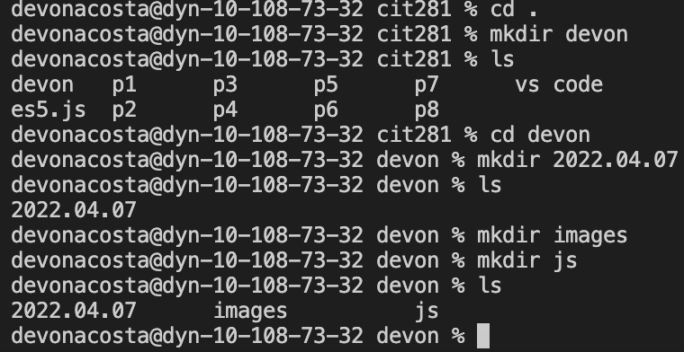
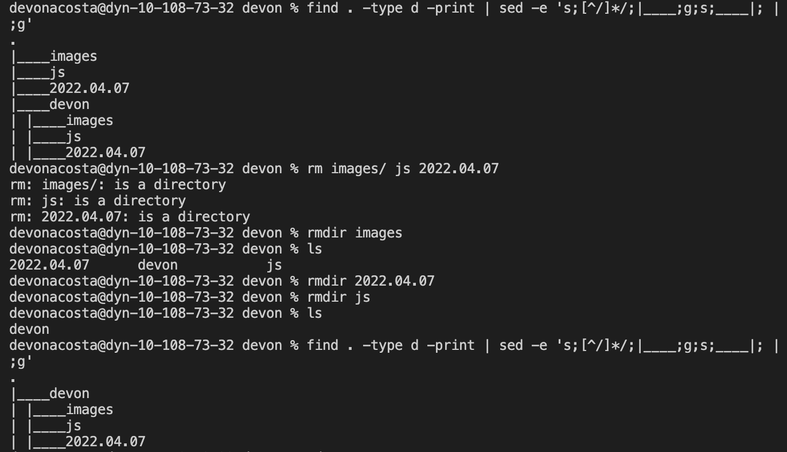
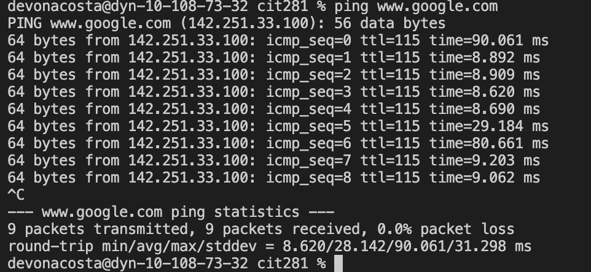
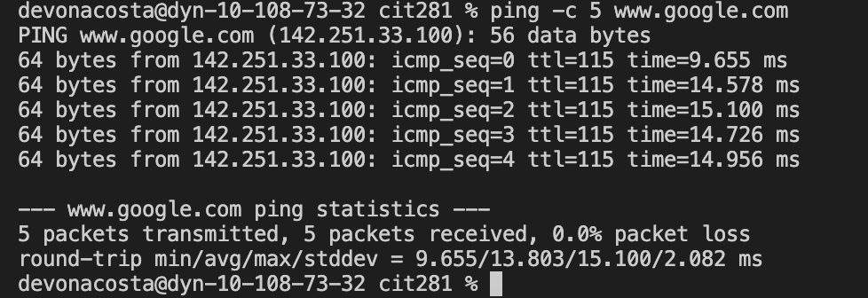

# cit281-p1

## Project Goals and Objectives 
Use the command line interface (CLI) of your operating system to create a number of folders
2. List the folders in a tree-like structure
3. Use the ping command, and practice using the break keyboard sequence
4. Create and execute a JavaScript files using Node.js and Visual Studio Code (VSCode) terminal and Run and Debug

### Project Deliverables
1. p1-folders.png

2. p1-tree.png

3. p1-break.png

4. p1-ping.png

5. p1-date.js
[p1-date.js](p1-date.js)

6. p1-random.js
[p1-random.js](p1-random.js)
